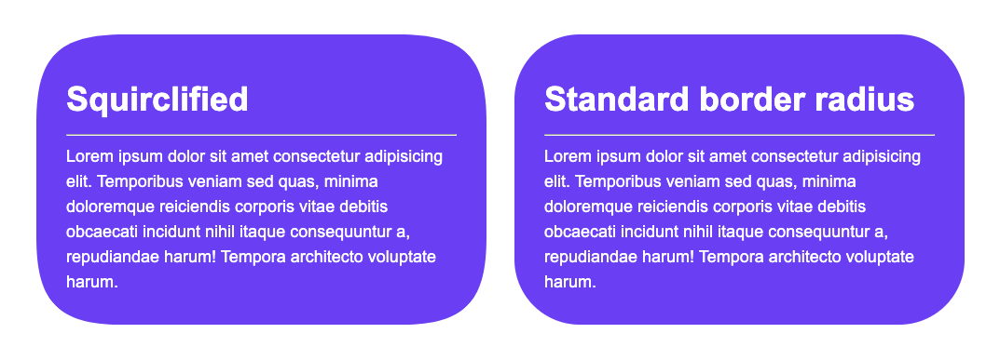

[](https://caniuse.com/#feat=css-clip-path)
[](https://www.gnu.org/licenses/gpl-3.0)


## What is it

`Squirclify.js` - microlibrary for creating smooth corners from any div, based on its border-radius size.

It imitates 100% smoothing corners at Figma:


### [CodeSandbox example](https://codesandbox.io/s/squirclify-example-lcrjc?file=/src/index.js)

## Result


## How to use

### 1. Vanilla javascript

```js
import { squirclify } from "squirclify";

squirclify(document.getElementById("squircle"));

<div className="squircle" id="squircle">
    <div className="ugly-child-wrapper">
        Lorem ipsum dolor sit amet
    </div>
</div>;
```

### 2. React.js

```js
import { Squircle } from "squirclify";

<Squircle className="squircle">
    <div className="ugly-child-wrapper">
        Lorem ipsum dolor sit amet
    </div>
</Squircle>
```

## Known restrictions
-   It only imitates 100% corner smoothing.
- Squircle will not recalculate when the viewport width changes by default. This is done on purpose, assuming that in most cases users do not resize the viewport. But you can add your own handler on viewport width changing.
-   There is a bug in Safari on Mac OS due to which the clip-mask is applied without considering paddings and margins, therefore it is necessary to wrap squirclified content with another `<div>` to which you need to apply margins/paddings.


## Known issues
- Squircle radius can became greater than border radius
